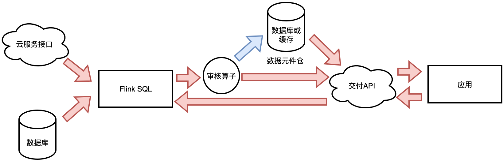
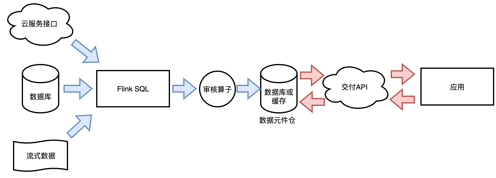

<p align="center">
<a href="./README.zh-CN.md">简体中文</a>｜<a href="./README.md">English</a>
</p>

# 元件开源项目

数据元件开源项目是一款数据安全计算框架，其核心技术是采用一套合规、安全的生产标准工序来保障数据要素化流通的合规性、不可逆性、易用性。

## 功能特性

* 支持三种元件类型的定义：模态元件、组态元件、组合态元件；
* 支持元件的元数据定义；
* 元件元数据与数据的标准审核算子；
* 元件生产的Flink离线生产套件；
* 元件交付的Netty交付服务套件；
* 元件核心类，用于定义标准的元件模型、元件生产、元件交付、元件审核接口，方便模块化扩展；
* 元件生产审核系列算子：
  + 数据不可逆审核算子：相似性审核、相关性审核、离群点审核、标识信息识别算子；
  + 通用算子：质检算子、信息项识别算子；
  + 合规算子：黄暴恐字典识别算子；

## 元件的三种类型介绍

* 模态元件：一般只有两个字段，主体字段一般为某业务主体的唯一标识，业务主体可以是设备、人、企业等。特征一般为某种泛化的标签。当进行元件交付时，一般会通过主体字段直接查询获取对应的特征值。

| **结构说明**   | **主体字段**           | **特征字段**  | 
|:-----------|:-------------------|:----------|
| *列名*       | *身份证号*             | *推广价值标签*  |
| 内容         | 11010*200001010000 | 中         |
| 内容         | 11010*200001010001 | 高         |
| 内容         | 11010*200001010002 | 低         |


* 组态元件：字段数量没有特殊要求，存储明细数据，但一定不含主体标识，主体标识需要去掉或者做匿名化处理。当元件进行交付时，往往通过索引和批量大小即可批量获取。

| **结构说明** | **索引号**       | **明细字段1**        | **明细字段2**       |
|:---------|:--------------|:-----------------|:----------------|
| *列名*     | *索引号*         | *企业年度投资总额（万元）*   | *企业年度营收总额（万元）*  |
| 内容       | 0             | 1200             | 3200            |
| 内容       | 1             | 2200             | -300            |
| 内容       | 2             | 900              | 200             |


* 组合态元件：有主体字段，多个特征字段，多个明细字段，多个查询字段。在元件交付时通过主体字段只能查询到多个特征字段，不能返回明细字段。使用查询字段可以批量查询到明细字段。

| **结构说明**  | **主体字段**           | **特征字段1**  | **特征字段2** |
|:----------|:-------------------|:-----------|:----------|
| *列名*      | *身份证号*             | *推广价值标签*   | *购买兴趣标签*  |
| 内容        | 11010*200001010000 | 中          | 美食        |
| 内容        | 11010*200001010001 | 高          | 汽车        |
| 内容        | 11010*200001010002 | 低          | 母婴        |


| **结构说明** | **索引号**  | **明细字段1**      | **明细字段2**      | **查询字段2** |
|:---------|:---------|:---------------|:---------------|:----------|
| *列名*     | *索引号*    | *企业年度投资总额（万元）* | *企业年度营收总额（万元）* | *省份*      |
| 内容       | 0        | 1200           | 3200           | 北京        |
| 内容       | 1        | 2200           | -300           | 上海        |
| 内容       | 2        | 900            | 200            | 深圳        |

## 元件生产的两种架构

### 调用即生产



如图所示，红色箭头为调用链，蓝色为异步数据流。应用在调用元件交付API时，交付API直接向Flink任务发起生产请求，使它即时获取数据并生产为元件返回给交付服务，最终交付给应用端。而生产出来的元件会异步的写入到缓存或数据库，可以在下次交付相同元件时命中。

### 预生产


如图所示，红色箭头为调用链，蓝色为异步数据流。应用在调用元件交付API时，主要请求缓存或数据库获取数据，不会触发元件生产。若想返回元件则需要进行预生产。

## 快速开始（Getting Started）

```shell
git clone https://github.com/secretflow/OpenDataComponent
cd OpenDataComponent
mvn install 
```
或者您可以使用IDE工具例如IDEA、Eclipse等导入Maven工程后，直接运行[opendatacomponent-examples](opendatacomponent-examples)模块中的Main函数。

## 代码示例
请您在模块[opendatacomponent-examples](opendatacomponent-examples)中进行查阅和试运行。
我们已经在该模块的Resource目录中准备了少量的样例数据，配合相关的样例程序进行使用。

你可以通过如下代码直接查看元件元数据、模态元件、组态元件、组合态元件的数据结构。
```java
DataComponentMetaExample dataComponentMetaExample1 = new DataComponentMetaExample("DataComponentDemo/DataComponentMetaDemo.json");
System.out.println("这是一个数据元件定义/开发阶段的元数据：" + dataComponentMetaExample1.getDefinitionJSON());
DataComponentMetaExample dataComponentMetaExample2 = new DataComponentMetaExample("DataComponentDemo/DataComponentMetaDemo.json");
System.out.println("这是一个数据元件生产阶段的元数据：" + dataComponentMetaExample2.getProductionSON());
ModalDataComponentExample modalDataComponentExample = new ModalDataComponentExample("DataComponentDemo/ModalDataComponentDemo.csv");
System.out.println("这是一个模态数据元件的数据部分：" + modalDataComponentExample.getJSON());
ComposedDataComponentExample composedDataComponentExample = new ComposedDataComponentExample("DataComponentDemo/ComposedDataComponentDemo.csv");
System.out.println("这是一个组态数据元件的数据部分：" + composedDataComponentExample.getJSON());
CombinatorialDataComponentExample combinatorialDataComponentExample = new CombinatorialDataComponentExample("DataComponentDemo/CombinatorialDataComponentDemo.csv");
System.out.println("这是一个组合态数据元件的数据部分：" + combinatorialDataComponentExample.getJSON());
```
## 如何生产元件
目前本项目提供两种生产模式：调用即生产、预生产两种。目前项目支持Flink-2.1.0 用Flink SQL生产元件。

### 调用即生产

所谓调用即生产，就是在调用元件交付接口时，触发元件生产。元件生产所需的数据源一般为多个Http Restful API。生产的逻辑是对多个API返回接口进行融合加工，即时返回元件结果。<br>
运行的示例已经放在[opendatacomponent-examples](opendatacomponent-examples)模块中，可以先启动
```Java
com.cec.example.Delivery.netty.DemoServer.main
```
启动后，DemoServer会在configPlugin方法中加载调用即生产相关的SQL，元件的交付接口为

```Java
http://localhost:8088/cap
```
该接口对应的Controller为：
```Java
com.cec.example.Delivery.netty.controller.CallAsProductionController
```
在Controller代码中已经提供了默认参数，所以在浏览器中直接请求call_modal接口就可以返回结果。
```json
{
  "requestId": "3b159d66-9cd0-4549-b623-b859e1065fd0",
  "enterprise_code": "900000000000000000",
  "processTime": "2025-11-25T09:50:06",
  "ratio": "70.0"
}
```
其中Flink SQL使用到了特定的connectors进行source和sink的配置。<br>
source
```SQL
--资源表模型
CREATE TABLE enterprise_info_tbl (
    code STRING,
    msg STRING,
    data ROW<
        enterprise_code STRING,--企业统一信用代码
        revenue_of_recycle DOUBLE,--废弃物回收营收(亿)
        measurement STRING,--物流环节减废措施
        update_time TIMESTAMP(3),--更新日期
        scale INT,--公司规模(人)
        registered_assets DOUBLE,--公司注册资产(亿)
        revenue_of_total DOUBLE--公司营收(亿)
    >,
   enterprise_code STRING NULL --虚拟列，为了where语句可以直接获取到“enterprise_code”
) WITH (
  'connector' = 'easy-rest',
  'url' = 'http://localhost:8088/r',
  'method' = 'GET',
  'interval' = '0',--0代表只请求一次，大于0则按照毫秒进行等到
  'format' = 'json'
)

--资源表模型
CREATE TABLE enterprise_city_tbl (
    code STRING,
    msg STRING,
    data ROW<
        enterprise_code STRING,--企业统一信用代码
        city STRING --城市
    >,
    enterprise_code STRING NULL --虚拟列，为了where语句可以直接获取到“enterprise_code”
) WITH (
  'connector' = 'easy-rest',
  'url' = 'http://localhost:8088/rd',
  'method' = 'GET',
  'interval' = '0',--0代表只请求一次，大于0则按照毫秒进行等到
  'format' = 'json',
  'listen.open' = 'true'
)

--为每一次请求生成请求ID与时间戳
CREATE TABLE request_tbl (
    requestId STRING,
    processTime TIMESTAMP(3) --调用日期
) WITH (
    'connector' = 'easy-rest',
    'url' = '',
    'method' = '$request',
    'interval' = '0',--0代表只请求一次，大于0则按照毫秒进行等到
    'format' = 'json',
    'listen.open' = 'true'
)


```
sink
```SQL
--模态元件表模型
--主体字段为企业信用代码，特征字段为废弃物回收业务占比
CREATE TABLE dc001_tbl (
    requestId STRING,
    processTime TIMESTAMP(3), --调用日期
    enterprise_code STRING,--企业信用代码
    ratio DOUBLE--废弃物回收业务占比
) WITH (
    'connector' = 'blockingMap'
)
```
生产使用的SQL，其中$数字为调用时可以传递的变量，以便于灵活的支持where条件传参
```SQL
SELECT
    requestId,
    processTime,
    t2.data.enterprise_code,
    t1.data.revenue_of_recycle/t1.data.revenue_of_total*100 AS ratio
FROM request_tbl, enterprise_info_tbl t1 LEFT JOIN enterprise_city_tbl t2
ON t1.data.enterprise_code = t2.data.enterprise_code
WHERE t1.enterprise_code='$1' AND t2.enterprise_code='$1'
```

### 预生产
元件预生产就是元件交付调用不直接触发元件生产，一般为元件生产后存储在交付调用的存储器上，比如redis、数据库等查询引擎，调用时直接读取事先存储好的元件数据。<br>
为了后续扩展交付存储，我们提供了可以通过填写交付接口实现类名称的Flink Sink来支持元件交付存储的写入。<br>
可以在[opendatacomponent-examples](opendatacomponent-examples)模块的
```java
com.cec.example.ProductionProcesses.flink.DataComponentProductionBatchExamples;
```
中看到示例代码。Sink SQL为：
```SQL
--模态元件表模型
--链接方式为Delivery输出
--主体字段为企业信用代码，特征字段为废弃物回收业务占比
CREATE TABLE modal_delivery_tbl (
    enterprise_code STRING,--企业信用代码
    ratio DOUBLE--废弃物回收业务占比
) WITH (
    'connector' = 'delivery',
    'db.name' = 'im_delivery',
    'dc.type' = 'modal',
    'dc.id' = 'DC002',
    'dc.main.key' = 'enterprise_code',
    'dc.delivery.class' = 'com.cec.deliver.InnerMemory.DataComponentDeliveryInnerMemory'
)
```

## 代码编译

编译环境准备：

* Unix-like environment (we use Linux, Mac OS X, Cygwin, WSL, Windows PowerShell)
* Git
* Maven (we require version 3.9.9)
* Java (version 20,21)

## 代码模块

* [opendatacomponent-core](opendatacomponent-core) 元件核心类，其他模块均依赖核心类，包含了元件、元件元数据实体类定义、扩展交付套件、生产套件的接口定义等。核心类不依赖于任何第三方代码包。
* [opendatacomponent-delivery-service](opendatacomponent-delivery-service) 元件交付服务套件，可以将元件数据写入数据库并提供高性能服务搭建框架代码。交付模块可以扩展，可以依赖tomcat、东方通、netty等服务中间件。
* [opendatacomponent-production-flink](opendatacomponent-production-flink) 元件生产套件，可以提供元件生产的框架代码。生产模块可以扩展，可以依赖Flink、Spark等成熟的计算框架。
* [opendatacomponent-examine-sdk](opendatacomponent-examine-sdk) 元件标准审核、元件生产审核的算子、数据脱敏SDK算子合集。
* [opendatacomponent-examples](opendatacomponent-examples) 元件生产工序中的各类子流程样例展示。样例代码理论上需要依赖所有模块，以便更好的展示各模块的调用方式。

